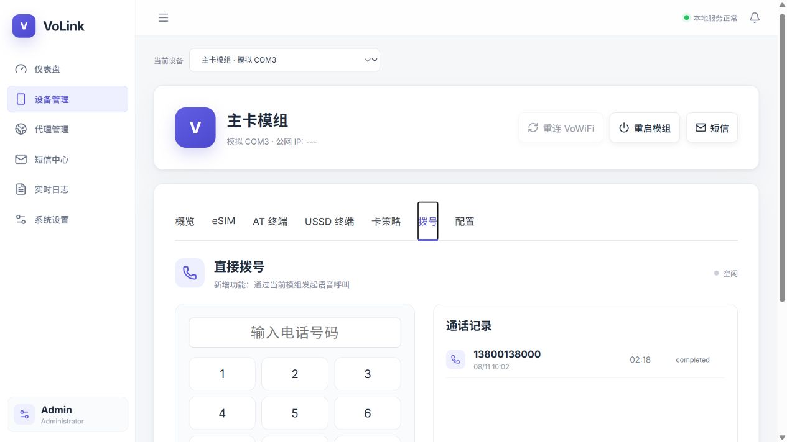

# VoLink

<p align="center">
  <strong>A modern Windows desktop control center for 4G/5G cellular modems.</strong><br>
  Windows 蜂窝模组管理、短信、拨号、eSIM、代理与通知中心。
</p>

<p align="center">
  <a href="https://github.com/w330590751/VoLink/actions/workflows/ci.yml"></a>
  <a href="https://github.com/w330590751/VoLink/releases/latest"></a>
  <a href="https://github.com/w330590751/VoLink/blob/main/LICENSE"></a>
  
  
</p>



VoLink is an independent Windows desktop implementation inspired by the workflows of VoHive. It discovers real modem ports, talks to modules through AT commands, and puts everyday cellular workflows in one interface.

VoLink 是一套独立实现的 Windows 蜂窝模组桌面软件。它能够自动发现真实模组端口，通过 AT 指令管理设备，并把 SIM、短信、拨号、eSIM、代理和通知整合到同一个界面中。

## Highlights / 主要功能

| Feature | Status | Details |
| --- | --- | --- |
| Multi-modem discovery | ✅ | Windows Modem + COM auto-discovery, hot-plug rescanning |
| SIM and network status | ✅ | Signal, operator, IMEI, IMSI, ICCID, registration and firmware |
| Direct calling | ✅ | Dial with `ATD<number>;`, hang up with `ATH`, local call history |
| SMS | ✅ | Send, sync, delete and store SMS; GSM/UCS2 support |
| AT and USSD terminals | ✅ | Raw commands and carrier USSD sessions |
| eSIM lifecycle | ✅* | Download, enable, disable, rename and delete through `lpac.exe` |
| HTTP / SOCKS5 proxy | ✅ | Multiple instances, authentication and mobile-interface binding |
| Notifications | ✅ | Telegram, Feishu, QQ Bot, Bark, Email, PushPlus and Webhook |
| Card policy | ✅ | APN, IP version, cellular network and airplane-mode controls |
| VoWiFi / IMS | Capability-gated | UI and policy model included; requires a separate carrier-compatible IMS backend |

`*` eSIM requires a compatible eUICC module, `AT+CSIM`, and a configured `lpac.exe`.

## Tested hardware / 已验证硬件

- Sierra Wireless EM7430 — modem discovery, COM17 AT control, SIM READY, ICCID/IMSI/IMEI reading
- Generic AT-compatible Quectel/SIMCom/Fibocom/Huawei/ZTE/Telit devices should work, but community hardware reports are welcome

If your module works, please open a [hardware compatibility report](https://github.com/w330590751/VoLink/issues/new?template=hardware.yml). It helps other users and improves automatic detection.

## Download / 下载

Download the latest portable Windows build from [GitHub Releases](https://github.com/w330590751/VoLink/releases/latest). No installation is required.

从 [GitHub Releases](https://github.com/w330590751/VoLink/releases/latest) 下载最新便携版，双击即可运行，无需安装。

> The executable is not commercially code-signed yet. Windows SmartScreen may show an “Unknown publisher” warning.

## Using real hardware / 使用真实硬件

1. Install the USB serial and WWAN drivers supplied by the modem vendor.
2. Start VoLink, open **System Settings**, disable simulation mode, and keep auto-scan enabled.
3. Insert the module. It should appear within one scan interval; the AT port can also be selected manually.
4. Connect the LTE/5G antennas and configure the correct APN when SIM is READY but signal or registration is unavailable.
5. Voice calls require voice-capable firmware. PC audio additionally requires USB Audio or the vendor's audio path.
6. eSIM requires a compatible eUICC and the full path to `lpac.exe` in settings.

## Development / 开发构建

Requirements: Node.js 22+ and Windows 10/11.

```powershell
npm install
npm run typecheck
npm run dev
```

Build the portable EXE:

```powershell
npm run dist
```

Output: `release/VoLink-1.0.0-portable.exe`

## Architecture

- Electron main process: hardware discovery, serial AT sessions, SMS, calls, proxy and notifications
- React renderer: VoHive-style device workspace and management UI
- Local JSON store: settings, devices, messages, call records and logs
- Context-isolated preload bridge: typed IPC between UI and hardware services

## Roadmap

- More tested modem profiles and automatic AT-port classification
- Native Windows Mobile Broadband / MBIM telemetry
- Incoming-call events and audio-device routing
- Carrier-specific VoLTE / IMS capability detection
- Signed installer and automatic updates

## Contributing

Bug reports, modem traces with identifiers removed, translations and hardware support patches are welcome. Read [CONTRIBUTING.md](CONTRIBUTING.md) before opening a pull request.

If VoLink is useful to you, consider starring the repository and sharing your tested modem model. ⭐

## License and attribution

VoLink is licensed under the [MIT License](LICENSE). It is an independent implementation and does not include VoHive source code or third-party AGPL VoWiFi daemons.
